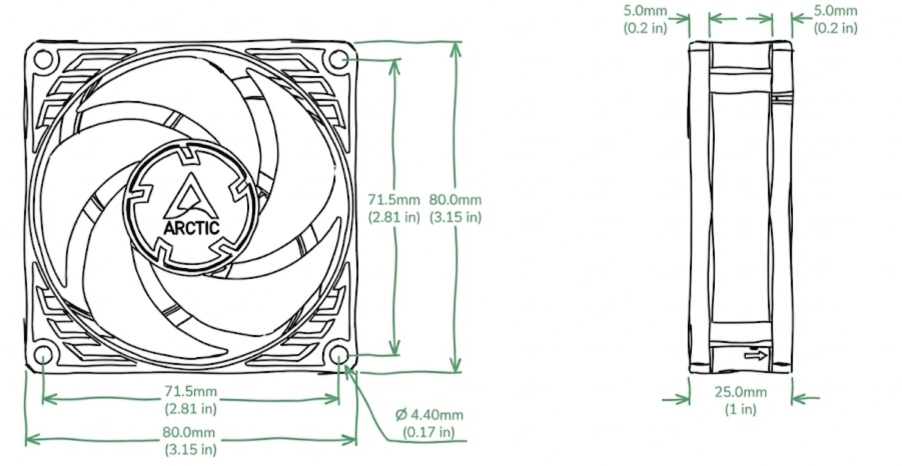
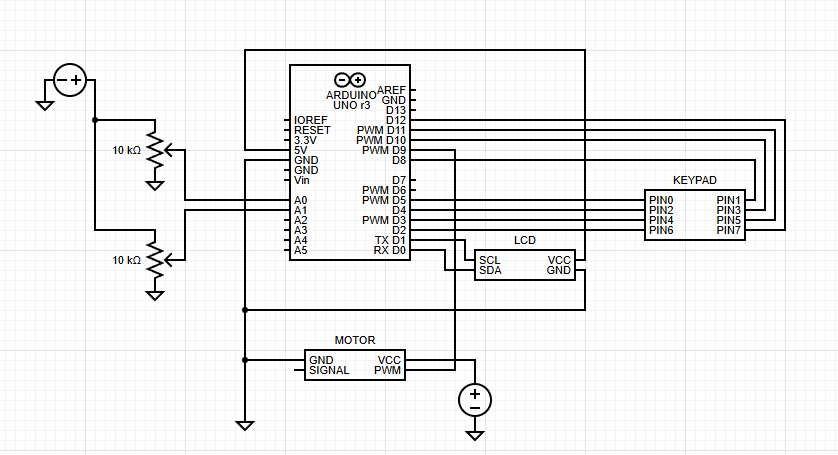

# Spin Coater

**Summary:** You'd probably think a spin coater is something you can knock out in one sitting. At first glance it's basically a PC fan spinning really fast, so how hard could it be?

That's exactly what we thought. We gave ourselves one week to build the whole thing.

## Intro
Once we actually started putting it together, it got real pretty fast. We started from BirdBrain's DIY spin coater design (one of the cheapest and simplest builds out there).

There's nothing wrong with his design, it works. The problem for us was the circuit and control. Once we got into the wiring, drivers, and power setup, we realized we were overcomplicating something that could be done way simpler for what we needed.

So we pivoted to a setup that gave us finer control, better repeatability, and less headache.

We switched to an Arduino-based setup with PWM control, two potentiometers (coarse and fine), and a small LCD for speed and job duration. The coarse pot sets the rough RPM range, the fine pot lets you dial in the last few percent, and the keypad is used to start/stop runs and choose presets.

The LCD shows target speed, current speed, and remaining time. That combo gave us way better repeatability and precision, which you actually need once you care about spin profiles instead of just 'fast' and 'faster'.

## Specifications
- Spin speed: ~600–3000 rpm (Arctic P8 Max @ 12 V under load)
- Speed control: Dual potentiometer (coarse: full range, fine: ±5% trim), PWM output from Arduino at 490 Hz
- Speed resolution: ~30–60 rpm per fine-adjust step (based on the PWM-to-RPM mapping we measured)
- Job duration: 1–300 s, adjustable in 1 s increments
- Substrate size: Up to 50 mm diameter (tested with 1×1 inch glass slides and 2 inch wafers)
- Power: 12 V DC input, ~0.12–0.20 A at steady 3000 rpm (≈2.4 W)
- Controller: Arduino Uno + I2C 1602 LCD + 4×4 membrane keypad
- Safety: Automatic spin-down on timeout, capped duty cycle at 85% to avoid overshoot, optional printed lid to contain splatter

## Bill of Materials
- Controller / UI: Arduino Uno, I2C 1602 LCD, 4×4 membrane keypad, 2× 10 kΩ potentiometers (speed + time / coarse + fine)
- Drive: Arctic P8 Max 12 V PC fan (or any 12 V brushless PC fan with similar RPM), Motor driver (logic-level MOSFET or driver module), 2N2222 transistor (for keypad / LCD backlight control if needed)
- Power: 12 V DC supply (at least 0.5 A recommended)
- Misc: Breadboard or perfboard, wires, solder, 3D printed housing and chuck

## Fan Preparation
The fan we used for this build is the Arctic P8 Max. It can hit around 3000 rpm and supports 5 to 12 volts, which makes it solid for a spin coater.

To get access to the motor, we had to take it apart, but this fan isn't like the usual ones where you just peel back the sticker. The teardown is a bit more involved, and you need to be careful. The first time we tried it, we accidentally tore the ground connection right off the 4-pin header.

The way we do it now:

Hold the fan with the sticker side facing away from you and the open side toward you. Put both thumbs on the fan hub (or the blades near the hub) and push with even pressure. Support the frame so you are not flexing the PCB or yanking on the wires.

If you line it up properly, the hub pops out cleanly without ripping the 4-pin header.

After that, pull off the fan blades and lightly sand the round motor cap. This is the surface that will actually spin and that you will mount your printed adapter onto, so you want it flat and clean.

This next part is optional, but if you do not have M3s longer than 50 mm, mounting everything gets annoying fast. The easier workaround is to trim the fan housing. Cut the outer frame roughly in half so only the motor housing and center supports are left.

That gives you a much lower profile, which makes it easier to bolt the fan down and keep it rigid without extra-long screws.

## Housing Assembly
Pretty self explanatory, refer to the printable for the full spec (BirdBrain's design):
[View Files on Printables](https://www.printables.com/model/658943-diy-spin-coater/files)

## Circuitry
The high level control loop is:

Pots → Arduino analog inputs (read speed / time setpoints)

Keypad → Arduino digital inputs (start/stop, preset select)

Arduino → PWM output pin → motor driver / MOSFET → 12 V fan

Fan tach wire (optional) → Arduino interrupt pin for RPM feedback

Arduino → I2C → LCD for UI

## What's Next
We are currently validating spin profiles for photoresist and testing repeatability across different substrate sizes.

Once we have consistent results, we'll publish the full Arduino code and wiring diagrams for anyone wanting to build their own.
