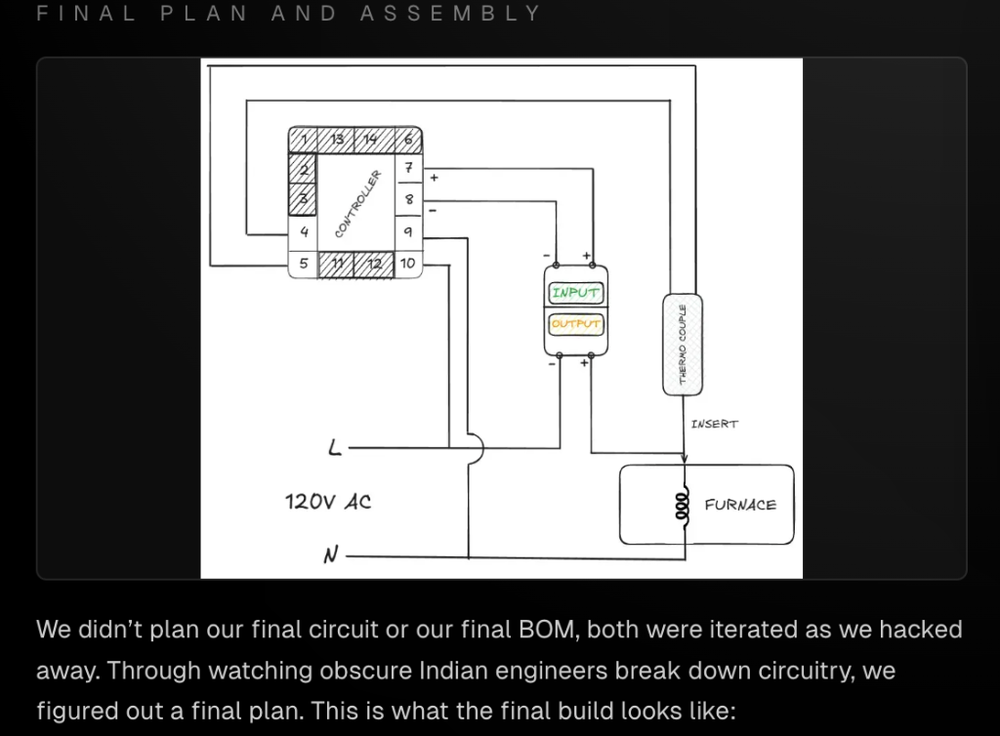

# Tube Furnace

**Summary:** Welcome to Hacker Fab’s first blog post! We consist of a small group of just three people, just trying to do things. We recently completed a huge milestone by creating a working tube furnace! It heats up exactly like an oven, uses resistive heating elements to raise temperatures. Although it sounds simple, there were a huge amount of challenges that we came across, of varying danger levels.

In this blog below, we break down exactly how we built a working and durable furnace without the hazards. Along the way, we’ll deep dive into exactly how everything was built and the problems that we came across the road. We want this blog to take you on a journey of how we approached and thought about the problem - specifically, working on things the hacky way, and building things up from first principles.

## Disclaimer
> **Warning:** This project poses high danger and we were surprised, even as electrical engineers, how much we did not know. There is a difference between being an electrical engineer, and an electrician. If you follow this tutorial, it means you proceed at your own risk and we are not responsible for any injuries resulting from this blog post.

## Background
Hacker Fab aims to provide a pipeline for chip tapeout at small scale, low cost. Our first goal is to be able to fabricate an NMOS transistor, which the tube furnace would allow us to accomplish. Specifically, the tube furnace is responsible for catalyzing the chemical reaction with silicon below:

$$ Si + O_2 \rightarrow SiO_2 $$

On the right (silicon dioxide) is a high-quality dielectric material that serves as the gate oxide in the nmos transistor structure. This chemical reaction only occurs at high temperatures between 900°C and 1200°C, which our tube furnace reaches by resistive heating.

The resulting SiO₂ layer thickness is controlled by temperature and oxidation time according to the deal-grove model, allowing us to grow precise gate oxide layers in the 10-100 nm range required for functional transistors.

Beyond gate oxide formation, thermal oxidation also enables field oxide isolation, passivation layers, and masking for subsequent doping steps in the NMOS fabrication process.

## How We Got Started
We got started by watching a few YouTube videos. Without them, it probably would’ve taken much longer to figure out proper build. As much detail as the video went into, it didn’t go into everything.

The BOM was missing, so we reverse image searched every piece of material we saw in the video. For the proper metal box, it turned out that cutting through metal was not that easy. The video uses a welding and machining setup, which we did not have.

Unfortunately U of T doesn’t support builders, and the machining shop manager did not like our tube furnace idea. We ended up buying a carbon steel box, and through a series of drilling holes with metal drills, metal cutters, and sanders, we slowly chipped away a circular opening for a glass tube to be fit in, aka. the hacky way.

Note for the electronics, we decided to use a programmable PID controller instead of the Arduino circuit, which we will detail later.

## Bill of Materials

| Item | Description/Value |
|------|-------------------|
| Heating Element | Nichrome wire - 0.65mm 22 AWG |
| Chamber | Quartz tube - 5/8" OD, 12" Long |
| Enclosure | Carbon steel box |
| Connectors | Spade terminals 10-12 AWG |
| Controller | Programmable digital PID controller (Ramp & Soak capable) |
| Sensor | Type K Thermocouple rated for high temperatures |
| Switching | Solid State Relay (SSR, 40A) + Heatsink |
| Insulation (Blanket) | Ceramic Fiber Blanket (>2600F) |
| Insulation (Board) | Ceramic Fiber Insulation Board |
| Wiring (Power) | 12 AWG Wire + 10 ft Heavy-Duty NEMA 6-15P to IEC C13 Cord |
| Wiring (Internal) | 12 AWG Silicone Wire High-Temp High-Voltage |
| Wiring (Interconnect) | 99.9% Pure Copper Wire 20 Gauge |
| Terminals | Wago 222 - 8-12 AWG 3POS |
| Adhesive (Refractory) | Sodium Silicate Firebrick Refractory Cement |
| Adhesive (Epoxy) | J-B Weld Original |
| Tape | Polyimide High Temperature Resistant Tape |
| Tools | Assortment of screwdrivers, lead cutter |

## Final Plan and Assembly
We didn’t plan our final circuit or our final BOM, both were iterated as we hacked away. Through watching obscure Indian engineers break down circuitry, we figured out a final plan. This is what the final build looks like:

The assembly of the furnace was simple with the BOM. Following the video’s steps through the glass tube assembly with the cement, and nichrome wire, we then made holes near the top of the tube furnace, using the same hacky way that we did for the glass tube.

Now the metal box has two openings on the sides, and two openings at the top. IT IS IMPORTANT THAT THESE HOLES AT THE TOP ARE SPACED WELL APART. Otherwise electrical arcing will happen, which you do not want to see. We ended up using ceramic tubing at the entrances for additional insulation when routing the wires through the exits of the metal box.

In a normal North American building, a standard 120 V outlet is guaranteed to be protected by a building breaker (or fuse) upstream. We properly bonded our furnace to the AC input’s PE (protective earth) green wire to the bottom of the metal box using a metal plate and metal screw. This provides a layer of safety incase, a short occurs. Additional safety can be achieved using a fuse, and a GFCI-installed outlet.

Now, it’s important next, that you consider where the nichrome wire could short and touch the metal box. Preventing a short mitigates electrical danger before it occurs. The nichrome wire could short near the entrances (closest to the metal box sides), and near the top (through the holes). The nichrome wire could also short with itself.

For shorts near the metal sides, you should unwind the corresponding nichrome wire wrapping if they’re too close to it’s closest metal side opening, and generally bend them away from the sides of the metal box. You should also avoid direct contact with the actual nichrome wounding of the glass tube, keep them away from this. We used the insulation to hold the the nichrome wire in place.

With copper wire, you should twist and wind to connect the copper to the nichrome, and then place the corresponding electrical tubing over it. Make sure that the electrical tubing is well insulated, a distance away from the glass tube, and it’s not close to the nichrome. Nichrome melts rubber, its much much more resistive than copper, and we learned it the hard way, saying goodbye to one of our Wago connectors. Now you know why your cables use copper wiring inside. After that step, cleanly route both copper wires through the top two holes. Use insulation to hold the copper wires in place now.

The protection both ceramics and rubber insulation makes it much harder for shorts to occur.

The rest of assembly involves connecting the circuitry parts, involving the PID controller, the SSR, and the actual furnace. We’ve covered everything that could go wrong. The rest of the build is textbook. High VAC is modulated by an SSR, controlled by the PID controller. The PID controller uses a linear ramp (settings described below), receiving feedback from thermocouple. Connect wires using Wagos. For additional safety, you should use the electrical tape to cover the PID controller’s pins that connect 120V L and N. Place the entire furnace metal box on top of the hard insulation platform.

## PID Basic Settings (hold set 3s)

| Parameter | Value |
|-----------|-------|
| SP | skip (manual setpoint, only used when run=0) |
| AL-1 | 1050 (high-temp safety alarm; triggers if PV > 1050°C) |
| AL-2 | 250 (secondary alarm; if it can’t go higher, leave it) |
| Pb | 0.0 (PV offset calibration) |
| P | 100 (proportional response strength) |
| I | 500 (integral correction speed) |
| d | 100 (derivative damping) |
| t | 2 (SSR drive cycle time) |
| FILT | 20 (smooths PV noise) |
| Hy | 0.5 (hysteresis) |
| dp | 0 (integer °C display) |
| outH | 200 (max output limit) |
| outL | 0 (min output limit) |
| AT | 0 (autotune off) |
| LocK | 0 (unlocked) |
| Sn | K (K-type thermocouple scaling) |
| OP-A | 2 (voltage pulse output for SSR) |
| C/F | C (Celsius units) |
| ALP | 1 (alarm mode so AL-1 acts as process high alarm) |
| COOL | 0 (heating logic) |
| P-SH | 1300 (high range) |
| P-SL | 0 (low range) |
| Addr | 1 (RS485 address - irrelevant) |
| bAud | 9600 (RS485 baud - irrelevant) |

## PID Program Settings (set + up 3s)
Goal: 1000°C target, 20°C/min ramp, then hold

| Parameter | Value |
|-----------|-------|
| SEC | 0 (time unit = minutes) |
| LOOP | 0 (run once, then stop) |
| PED (PdE) | 0 (power-loss behavior = safest) |
| AL_P | 10.0 (wait zone; AT may flash if PV lags SV by >10°C) |
| run | 3 (program enabled/running) |
| r1 | 49 (ramp time to C1; ~20°C/min) |
| t1 | 30 (hold time at C1 in minutes) |
| C1 | 1000 (target temperature) |
| r2 | 0 (end program after segment 1) |

## Testing
After setting everything up, you should test in the following manner. First start off by testing the PID controller, WITHOUT the furnace plugged in, only the controller cable. We suggest using an outlet extender with a switch to turn on/off both components for easy and safe testing.

What you should see:
- PV (top) = current temp (measured by thermocouple)
- SV (bottom) should start near the starting value and increase gradually, not jump

If you see this, you got the PID controller working! Unplug the controller. The settings and state will be saved internally. With the outlet extender off, plug in both the controller cable, and the furnace cable. Now for the moment of truth, turn on the outlet extender. Your furnace should be heating up now. This is where you should be the most careful. The nichrome wire will glow red at times, only for a short bit, before the current decreases as it’s modulated by the PID controller. The cement should protect the glass tube from any heat damage.

## Remarks
If you did everything correct, you should see the furnace glow red near 700C! Congrats! You just did things the hacky way.

Along this journey, we definitely learned a lot! We learned a new way of thinking about problems, starting from everything that could go wrong, when the problem poses extreme danger.

If you got this far, please do let us know! We tried to make this blog as detailed as possible, but with everything, we can only describe so far. Please reach out to any of us if you have any questions.
